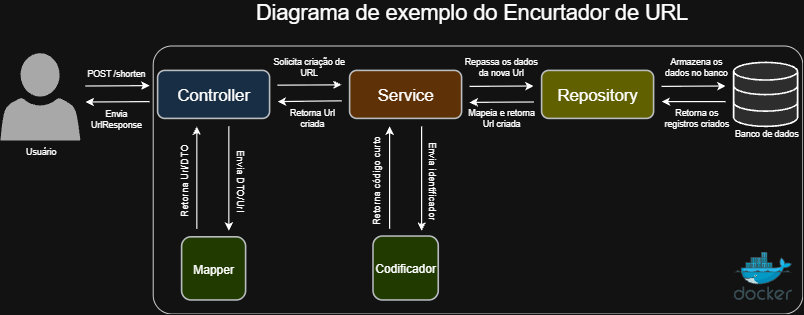
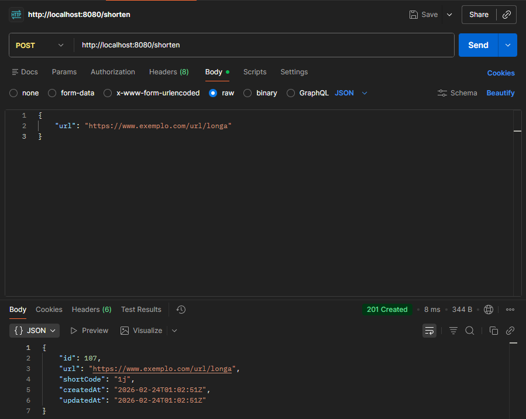
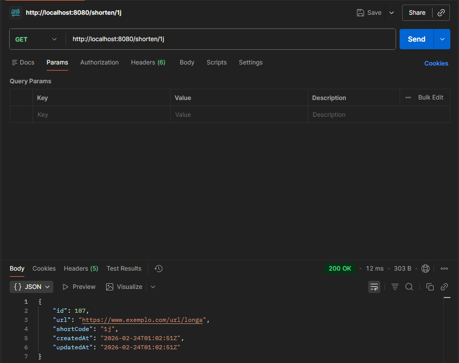
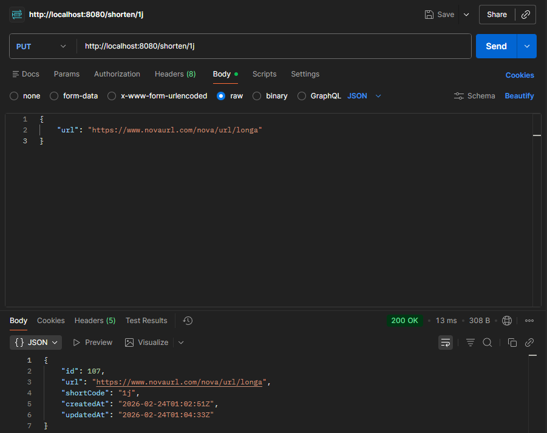
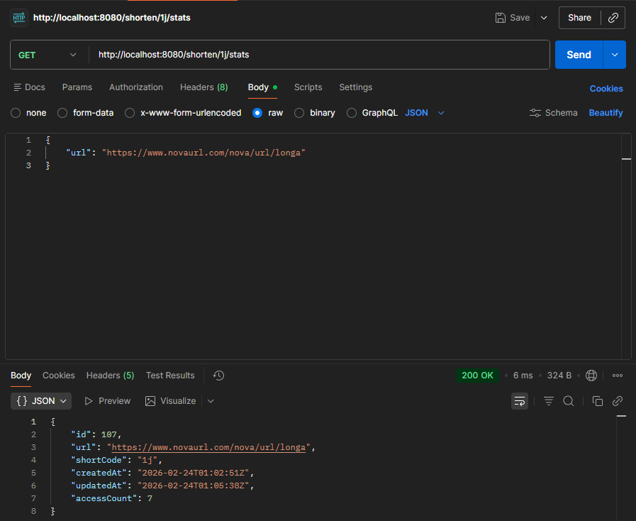
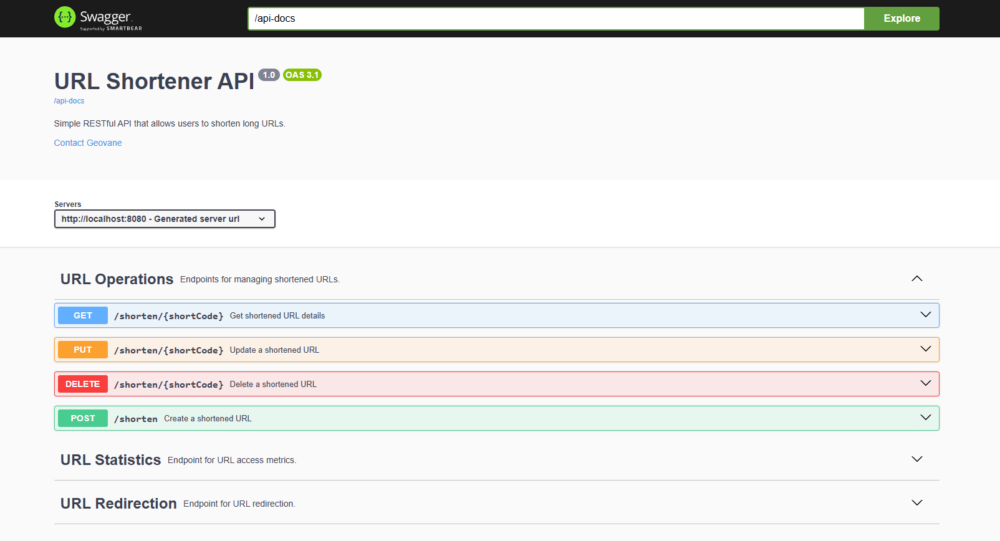
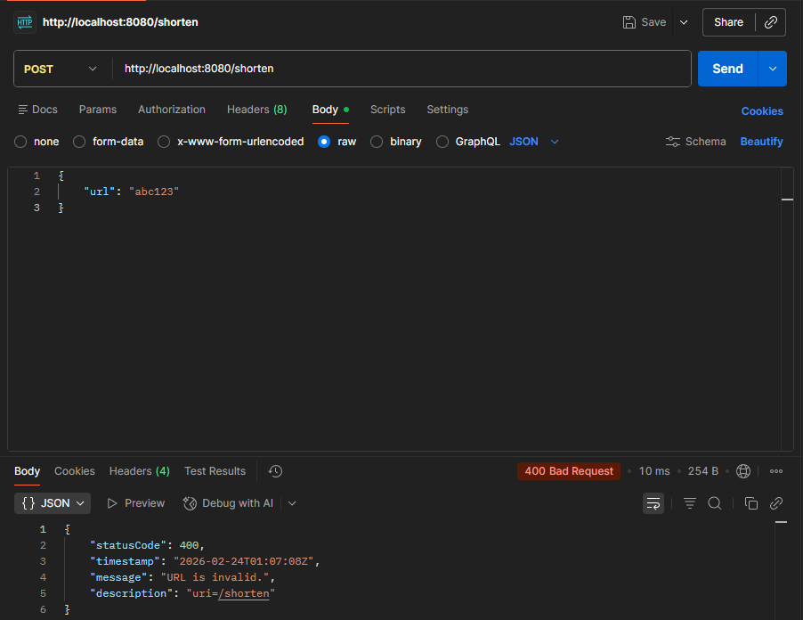

# Encurtador de URL (Spring Boot + Docker)




### Descrição

API REST desenvolvida com Spring Boot para encurtar URLs longas. O projeto gerencia todo o ciclo de vida das URLs (CRUD), realiza redirecionamentos e fornece dados sobre o uso delas.

---

### Funcionalidades

- Criação, busca, atualização e remoção de URLs.
- Redirecionamento para URL original através de código único.
- Validação de dados usando DTO.
- Tratamento global de exceções.
- Testes automatizados (unitário e integração).
- Documentação completa usando Swagger/OpenAPI.

---


### Stack

- Java 21, Spring Boot 3
- JUnit 5, Mockito, Swagger/OpenAPI
- Docker Compose, PostgreSQL, Maven

---

### Endpoints
1. Encurtar URL
<ul>

```http
POST /shorten
{
  "url": "https://www.exemplo.com/url/longa"
}
```
Response:
```json
{
  "id": 107,
  "url": "https://www.exemplo.com/url/longa",
  "shortCode": "1j",
  "createdAt": "2026-02-22T21:06:00Z",
  "updatedAt": "2026-02-22T21:06:00Z"
}
```
O endpoint retorna o código de status http `201 Created` caso os registros da URL sejam criados e armazenados, senão `400 Bad Request` em erro de validação.

</ul>

<br>


2. Obter dados de uma URL
<ul>

```
GET /shorten/{shortCode}
```

Response:
```json
{
  "id": 107,
  "url": "https://www.exemplo.com/url/longa",
  "shortCode": "1j",
  "createdAt": "2026-02-22T21:06:00Z",
  "updatedAt": "2026-02-22T21:06:00Z"
}
```
O endpoint retorna o código de status http `200 Ok` caso os registros da URL sejam encontrados, senão `404 Not Found`.

</ul>

<br>

3. Atualizar URL
<ul>

```http
PUT /shorten/{shortCode}
{
  "url": "https://www.exemplo.com/nova/url/longa"
}
```
Response:
```json
{
  "id": 107,
  "url": "https://www.exemplo.com/nova/url/longa",
  "shortCode": "1j",
  "createdAt": "2026-02-22T21:06:00Z",
  "updatedAt": "2026-02-22T21:55:00Z"
}
```
O endpoint retorna o código de status http `200 Ok` caso os registros da URL sejam atualizados, senão `400 Bad Request` ou `404 Not Found` caso não sejam encontrados.

</ul>

<br>

4. Deletar URL
<ul>

```
DELETE /shorten/{shortCode}
```
O endpoint retorna o código de status http `204 No Content` caso os registros da URL sejam encontrados e apagados, senão `404 Not Found`.

</ul>

<br>

5. Obter estatísticas de uma URL
<ul>

```
GET /shorten/{shortCode}/stats
```
Response:
```json
{
  "id": 107,
  "url": "https://www.exemplo.com/url/longa",
  "shortCode": "1j",
  "createdAt": "2026-02-22T21:06:00Z",
  "updatedAt": "2026-02-22T21:55:00Z",
  "accessCount": 6
}
```
O endpoint retorna o código de status http `200 Ok` caso os registros da URL curta sejam encontrados, senão `404 Not Found`.

</ul>

<br>

6. Redirecionar para uma URL
<ul>

```
GET /{shortCode}
```
O endpoint retorna o código de status http <code>302 Found</code> caso os registros da URL sejam encontrados, senão <code>404 Not Found</code>.

</ul>

---

### Instalação
1. Pré-requisitos
<ul>

- Docker

<code> https://docs.docker.com/get-docker/ </code>

</ul>

2. Clone o repositório
<ul>

```bash
git clone https://github.com/geovanegsfarias/url-shortener-api.git
```

</ul>


3. Configure as variáveis de ambiente

<ul>
Crie um arquivo <code>.env</code> na raiz do projeto com as credenciais do banco de dados:

```
POSTGRES_DB=url_shortener_db
POSTGRES_USER=root
POSTGRES_PASSWORD=password
```
</ul>

4. Suba os containers
<ul>
O arquivo <code>docker-compose</code> configura todo o funcionamento da aplicação:

```bash
docker compose up -d
```

</ul>

5. Acesse a API
<ul>

- A aplicação está disponível em http://localhost:8080.

- Documentação com Swagger em http://localhost:8080/swagger-ui.html.

- Execute todos os testes automatizados com `./mvnw test`.
</ul>

---

### Screenshots

<details>
<summary>Clique para exibir</summary>
<p>Imagem 1</p>

<p>Imagem 2</p>

<p>Imagem 3</p>

<p>Imagem 4</p>

<p>Imagem 5</p>

<p>Imagem 6</p>

<p>Imagem 7</p>

</details>